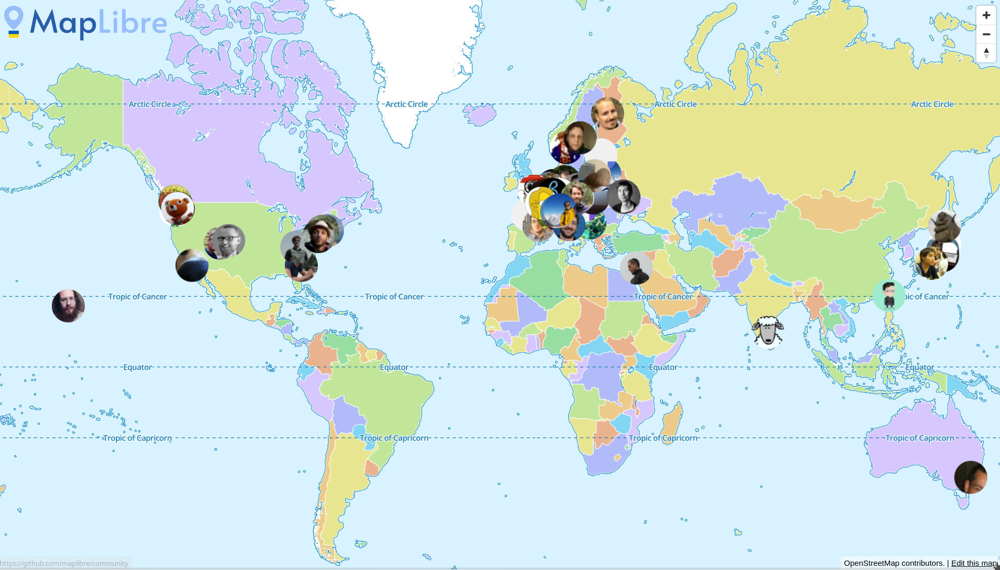

# DEPRECATED

The community map moved to the main website https://github.com/maplibre/maplibre.github.io/

# community
MapLibre community map 

Source code of https://maplibre.org/community/ which shows a map of the MapLibre community members.

The map shows contributors to MapLibre projects as recorded in the public git committer history.

Location information was taken from people's public GitHub profiles.

## Please Add Me

If you would like to be included in the MapLibre community map, fork this repo, edit `community.json`, and make a pull request. Or just open an issue...

## Please Remove Me

If you are on the map, but don't want to be, please open a pull request or issue.
